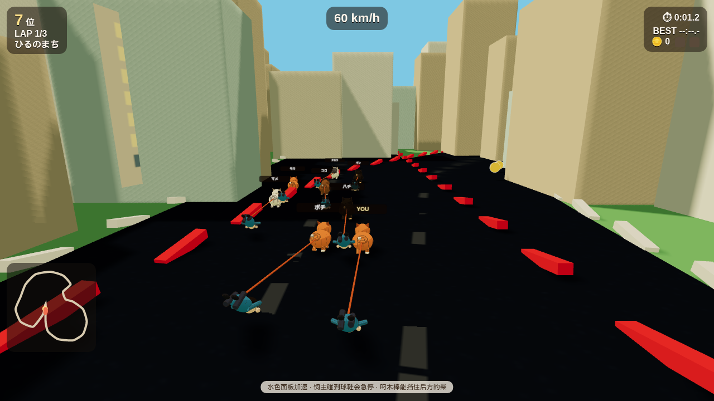

# SHIBA DASH!! お散歩グランプリ

致敬 [AMIX / トミナガハルキ 的 SHIBA DASH!!](https://amix-design.com/tl/tool-g-shiba/) 的浏览器 3D 竞速复刻。柴犬自己往前冲，你只负责转向；金币必须用被拖着的饲主去捡。美术全部程序生成，基于 three.js。

    
    

## 怎么玩

- **←→ / A D** 转向（犬会自动跑）
- **空格** 消耗 Coin Dash（每 15 枚金币积 1 格，最多 2 格）
- **P / Esc** 暂停
- 水色面板 = SHIBA DASH 加速
- 饲主碰到浮空球鞋会急停大减速
- 叼到木棒可以暂时挡住后方的柴
- 弯道里稳住转向会积攒漂移加速
- 难易度：幼柴 3 周 / 若柴 3 周 / 厳柴 5 周

## 犬種

| 犬 | 特点 |
| --- | --- |
| 赤柴 | 平衡，最好上手 |
| 黒柴 | 极速，弯道较钝 |
| 白柴 | 过弯灵巧，Dash 强 |
| 胡麻柴 | 金币加速最猛 |

## コース

ひるのまち → ゆうやけロード → あめの散歩 → SHIBA COOL → くだり川 → SHIVA 2049

## 本地运行

```bash
npm install
npm run dev
```

冒烟测试：`npm run smoke`

本仓库是玩法向的致敬复刻，不含原作资源；原作请在 AMIX 站点游玩。
