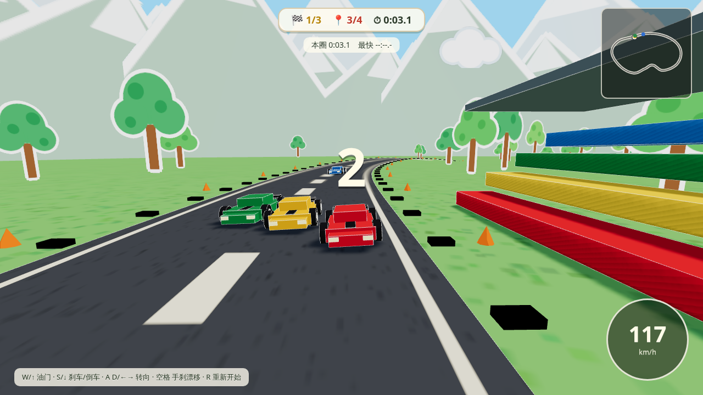

# 北京平台跳跃 Beijing Platformer

熊猫跑酷:从天安门一路跳到鸟巢的剪纸风 3D 平台跳跃游戏,基于 three.js,美术全部程序生成。

**在线试玩:** https://enotsixlm.github.io/beijing-platformer/


## 路线

天安门 → 胡同 → 灯笼巷 → 天坛 → CBD → 水立方 → 鸟巢

## 剪纸拉力赛 Paper Rally

同一套剪纸美术风格下的第二个小游戏:程序生成的环形赛道拉力赛,3 圈对抗 3 位 AI 车手,支持漂移过弯、迷你地图、圈速与排名 HUD。入口:`racing.html`(标题界面也有互相跳转的链接)。



## 本地运行

```bash
npm install
npm run dev
```

打开 `/` 进入跑酷,打开 `/racing.html` 进入拉力赛。

## 测试

```bash
npm run smoke          # 跑酷冒烟测试
npm run smoke:racing   # 拉力赛冒烟测试
npm run smoke:all      # 全部冒烟测试

npm run shots          # 跑酷截图
npm run shots:racing   # 拉力赛截图
```

首次运行需下载与 `playwright-core` 版本匹配的无头浏览器:

```bash
node node_modules/playwright-core/cli.js install chromium
```
